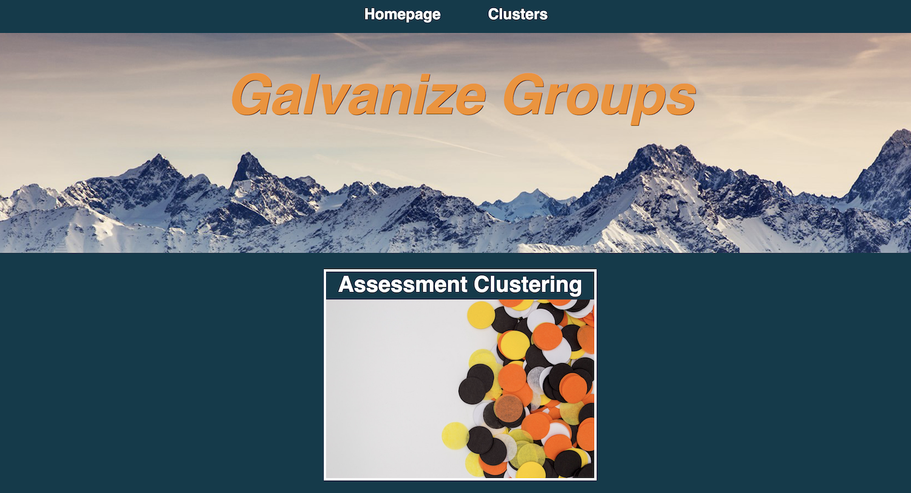
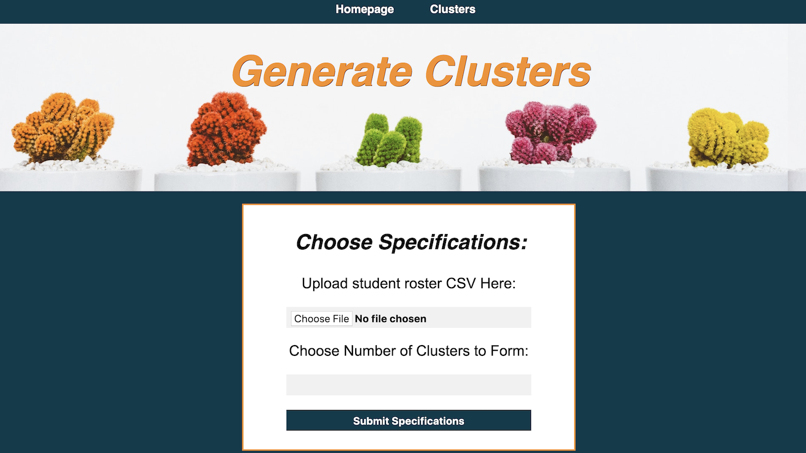
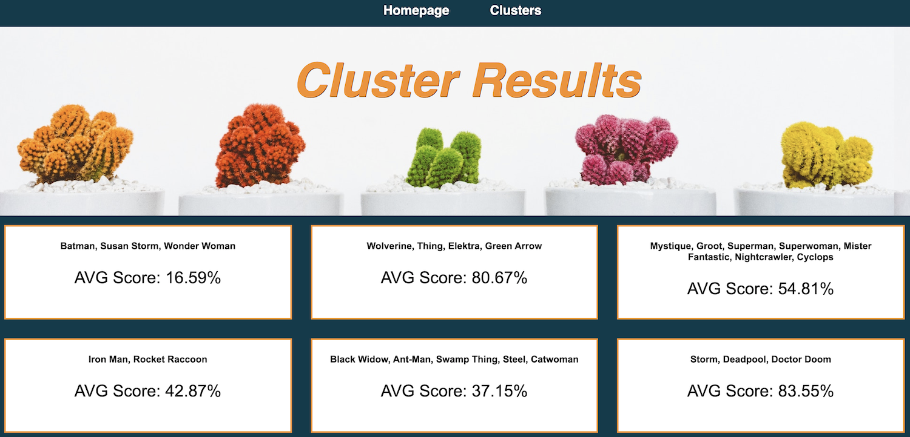

# Galvanize Groups
Group up at [http://galvanizegroups.bxzcwumakq.us-east-2.elasticbeanstalk.com/](http://galvanizegroups.bxzcwumakq.us-east-2.elasticbeanstalk.com/)

||
|---|


## Project Motivation

- Educators have countless tasks to complete and very limited time to do so. 
- This project aims to tackle the very important (and very time consuming) task of effectively grouping students. 
- Providing educators with a simple tool to create groups of students using insights driven by data can help them spend more time planning engaging lessons and creating personalized education experiences.

## Generating Clusters From Assessments

### Clustering Inputs

CSV File
```
Educators  upload a CSV file with student names and assignment scores
```
Number of Clusters
```
Choose between 2-9 clusters to break students into
```

## How it Works


||
|---|

||
|---|

### KMeans Clustering
The KMeans Clustering algorithm seeks to create clusters of similar students using student assessment data. 

It does this through randomly assigning a fixed number of cluster centroids and iteratively associating the remainder of the data points to the nearest centroid.


## Tools Used
- Python
- Flask
- Scikit-Learn
- Elastic Beanstalk


## Acknowledgments

* Thank you to all the teachers for your unwavering support and courage to students everywhere
